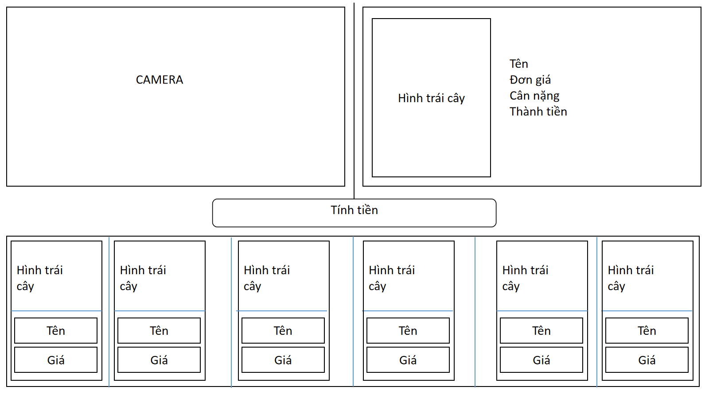

# Fruit Recognition Checkout

Smart checkout prototype that uses a webcam, a TensorFlow image classifier, Firebase Realtime Database weight/price data, and a React cart UI to identify produce and calculate totals.



## What This Project Does

This repository contains a complete fruit and vegetable recognition workflow:

- The **frontend** opens the webcam, captures an image, sends it to the API, shows the predicted product, reads weight and price data from Firebase, builds a cart, and exports an invoice PDF.
- The **backend** serves a Flask API for image prediction, dataset folder management, photo capture storage, and optional retraining.
- The **model assets** include the current Keras model, class label file, and image archive used for training/testing/validation.
- The **hardware bridge** reads weight values from a serial device and writes `CanNang` to Firebase.

## Repository Layout

```text
fruit_recognition/
+-- backend/
|   +-- app.py                         # Main Flask API on port 3000
|   +-- requirements.txt               # Python dependencies
|   +-- legacy_predict_api.py          # Older prediction-only API kept for reference
|   +-- hardware/
|   |   +-- UART.py                    # Serial scale to Firebase bridge
|   |   +-- ttiot-...json              # Firebase admin credential used by UART.py
|   +-- ml/
|       +-- model/
|       |   +-- model.h5               # Active TensorFlow/Keras model
|       |   +-- kind.txt               # Class labels, one per line
|       |   +-- my_model.keras         # Additional saved model artifact
|       +-- data/archive/
|           +-- train/                 # Training images grouped by class
|           +-- test/                  # Test images grouped by class
|           +-- validation/            # Validation images grouped by class
+-- frontend/
|   +-- package.json                   # Vite React scripts
|   +-- src/
|       +-- pages/Home.jsx             # Main checkout screen
|       +-- pages/Setting.jsx          # Teachable Machine camera test screen
|       +-- firebase.js                # Firebase client config
|       +-- assets/image/              # Product images shown in the UI
+-- notebooks/
|   +-- datn1.ipynb                    # Original training/exploration notebook
+-- legacy/
|   +-- index.html, main.html, style.css
|   +-- model.h5
|   +-- kind_df.txt                    # Older standalone prototype assets
+-- docs/
    +-- web-mockup.png                 # UI reference image
```

## Requirements

- Python 3.10 or 3.11 recommended
- Node.js 18+ recommended
- A webcam for frontend recognition
- Firebase Realtime Database access
- Optional: serial scale or microcontroller connected to the configured COM port for live weight updates

## Backend Setup

From the repository root:

```bash
cd backend
python -m venv .venv
.venv\Scripts\activate
pip install -r requirements.txt
python app.py
```

The API starts at:

```text
http://127.0.0.1:3000
```

Important endpoints:

| Method | Endpoint | Purpose |
| --- | --- | --- |
| `POST` | `/predict` | Accepts multipart form field `image` and returns `class_label` plus `class_probability`. |
| `POST` | `/save_photo` | Saves a base64 camera image under `backend/ml/data/archive/train/<username>/`. |
| `GET` | `/list_folders` | Lists training class folders. |
| `DELETE` | `/delete_folder?folder=<name>` | Deletes a training class folder. |
| `POST` | `/train_model` | Retrains the model from `backend/ml/data/archive/train/` and rewrites `backend/ml/model/model.h5` and `kind.txt`. |

## Frontend Setup

Open a second terminal from the repository root:

```bash
cd frontend
npm install
npm run dev
```

Vite prints a local URL, usually:

```text
http://127.0.0.1:5173
```

Use the UI in this order:

1. Start the backend first with `python app.py`.
2. Start the frontend with `npm run dev`.
3. Open the Vite URL in a browser.
4. Allow camera access.
5. Click **Open Camera**.
6. Click **Process Image**.
7. Review product name, weight, price, and total.
8. Click **Add to Cart**.
9. Open the cart and generate the invoice PDF.

## Hardware Bridge

`backend/hardware/UART.py` reads serial data and pushes the latest weight to Firebase as `CanNang`.

Run it from the repository root:

```bash
cd backend\hardware
python UART.py
```

Before running, check these values in `UART.py`:

- `serial_port = 'COM8'`: change this to the port used by your scale or microcontroller.
- `baud_rate = 115200`: match this to the device firmware.
- Firebase credential JSON: currently stored beside `UART.py`.

## Model And Data Notes

- The active model is `backend/ml/model/model.h5`.
- The active class label file is `backend/ml/model/kind.txt`.
- The backend resizes images to `224x224`, normalizes pixels to `0..1`, and returns the highest-probability class.
- Training images should be arranged as `backend/ml/data/archive/train/<class-name>/<image>.jpg`.
- The current dataset includes common produce classes such as apple, banana, carrot, corn, cucumber, mango, onion, orange, tomato, watermelon, and more.

## Troubleshooting

- **Frontend cannot predict:** confirm the backend is running on `http://127.0.0.1:3000`.
- **Camera does not open:** allow browser camera permission and close other apps using the webcam.
- **Class names file not found:** confirm `backend/ml/model/kind.txt` exists.
- **Model load fails:** confirm `backend/ml/model/model.h5` exists and TensorFlow/TensorFlow Hub installed correctly.
- **Weight is always zero:** confirm Firebase has a `CanNang` value or run the serial bridge.
- **Serial bridge fails:** verify the COM port, baud rate, and Firebase admin JSON path.

## Security Note

The repository currently contains Firebase configuration and an admin credential JSON used by the hardware bridge. For a public repository, rotate that credential, remove it from git history, and load secrets from environment variables instead.
